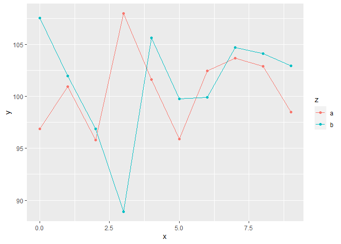
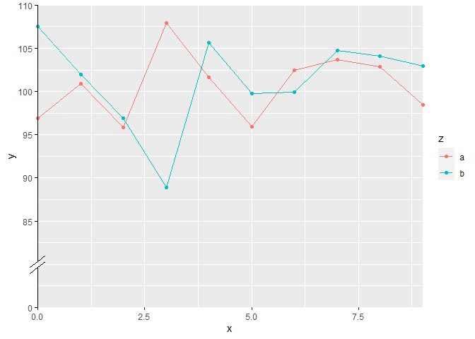
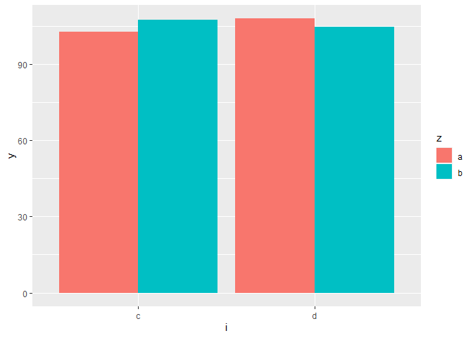
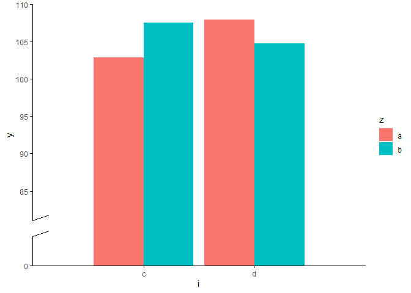

<!-- README.md is generated from README.Rmd. Please edit that file -->

## ggygap

<!-- badges: start -->
<!-- badges: end -->

ggygap allows to easily add a gap in y-the axis of ggplots.

## Installation

    devtools::install_github("lukekorthals/gg-ygap")
    library(ggygap)

## Example

1.  Create and edit your graph like you would normally do and assign it
    to a variable (e.g. p).
2.  Use gg.y_gap() to add your gap in the y axis.
3.  gg.y_gap() returns a ggplot you can work with as usual.

``` r
#devtools::install_github("lukekorthals/gg-ygap")
library(ggplot2)
library(ggygap)

# Example Data
set.seed(1)
x <- rep(0:9, 2)
y <- rnorm(20, mean=100, sd=5)
z <- c(rep("a", 10), rep("b", 10))
i <- rep(c("c", "d"), 10)
dat <- data.frame(x, y, z, i)
dat$i <- factor(dat$i)

# 1. Create Plot
p <- ggplot(dat, aes(x=x, y=y, color=z, group=z)) +
  geom_point() +
  geom_line() 
p
```



``` r

# 2. Add Gap (Continuous-X Example)
gg.y_gap(p, y_segment_start = 85, y_segment_end = 110, break_step = 5)
```



``` r

# 3. Continue Working With Your Plot (Categorical-X Example + Additional Params)
p1 <- ggplot(dat, aes(x=i, y=y, fill=z, group=z)) +
  geom_bar(stat="identity", position="dodge")
p1
```



``` r
gg.y_gap(p1, y_segment_start = 85, y_segment_end = 110, break_step = 5,
         gap_lines = "r", gap_line_length = 0.05, gap_width = 0.03) +
  theme(
    panel.background = element_blank(),
    axis.line = element_line(colour = "black")
  )
```



## Bugs and Feature Requests

I developed the function for a very specific plot. Consequently, there
will likely be many bugs and unsatisfied use cases - if you catch any,
let me know :)

Report bugs here: <https://github.com/lukekorthals/gg-ygap/issues>
